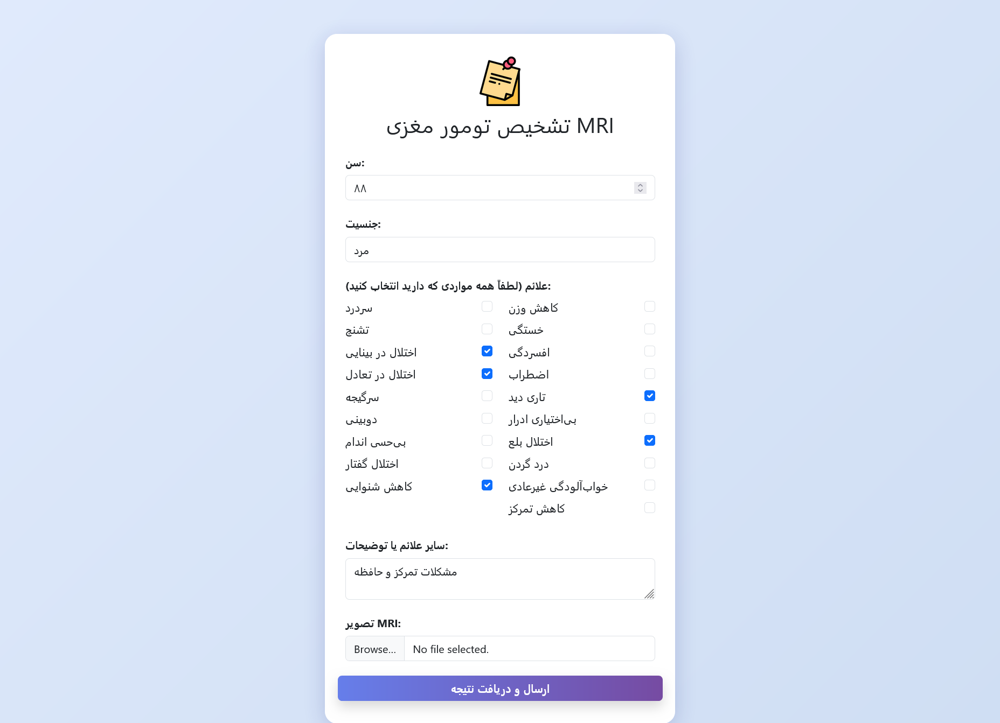
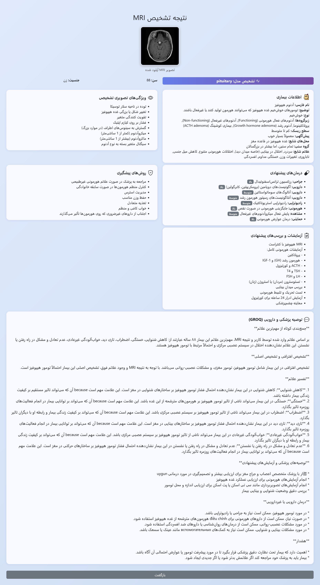

# Brain Tumor Detection Web App

This project is a web-based application for brain tumor detection using MRI images and patient symptoms. It leverages a deep learning model (PyTorch) to classify brain tumors into four categories: **glioma**, **meningioma**, **pituitary tumor**, and **no tumor**. The app also provides medical advice and explanations in Persian, integrating AI-powered recommendations.

## Features

- **Upload MRI Images:** Users can upload their brain MRI images in JPG or PNG format.
- **Symptom Input:** Users can select and describe their symptoms (in Persian).
- **Automatic Tumor Classification:** The app predicts the tumor type using a trained PyTorch model.
- **Personalized Medical Advice:** The app provides detailed explanations, possible diagnoses, suggested tests, and treatment recommendations in Persian, using AI (GROQ API).
- **User-Friendly Interface:** The app is built with Flask and Bootstrap, supporting right-to-left (RTL) Persian text.

## How It Works

1. **User uploads an MRI image** and enters basic information (age, gender) and symptoms.
2. The app preprocesses the image and uses a deep learning model to classify the tumor.
3. The result page displays:
   - The predicted tumor type
   - Disease information and common symptoms
   - Diagnostic imaging features
   - Suggested treatments and prevention methods
   - Recommended tests
   - AI-generated medical advice in Persian

## Screenshots

### Main Page (`index.html`)


### Result Page (`result.html`)



## Installation

1. **Clone the repository:**
   ```bash
   git clone https://github.com/yourusername/brain-tumor-app.git
   cd brain-tumor-app
   ```

2. **Install dependencies:**
   ```bash
   pip install -r requirements.txt
   ```

3. **Add your trained model:**
   - Place your PyTorch model file as `model_full.pt` in the project root.

4. **(Optional) Set up GROQ API key:**
   - If you want to enable AI-powered medical advice, set your GROQ API key in `app.py`.

5. **Run the app:**
   ```bash
   python app.py
   ```

6. **Open your browser and go to:**
   ```
   http://127.0.0.1:5000/
   ```

## Project Structure

```
brain tumor app/
  ├── app.py
  ├── templates/
  │   ├── index.html
  │   └── result.html
  ├── uploads/
  ├── index_screenshot.png
  └── result_screenshot.png
```

## Notes

- The app and its medical advice are for educational and research purposes only and **should not be used as a substitute for professional medical diagnosis or treatment**.
- All AI-generated advice is in Persian (Farsi).
- The model must be trained and exported as `model_full.pt` for the app to work.

## License

This project is open-source. See the [LICENSE](LICENSE) file for details. 
